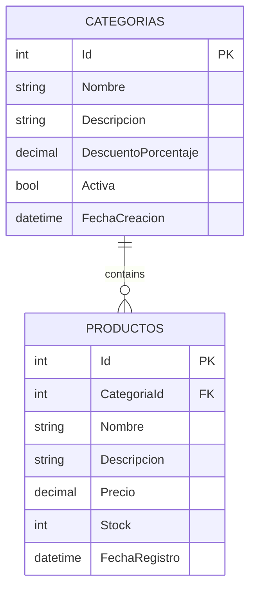

# Code First, PostgreSQL, and LINQ Queries

## Table of Contents

1. [Summary](#1-summary)
2. [Project Documentation](#2-project-documentation)
3. [Main Features](#3-main-features)
4. [Technologies](#4-technologies)
5. [Database Schema](#5-database-schema)
6. [How to Run](#6-how-to-run)
7. [Expected Result](#7-expected-result)

## 1. Summary

This project is an ASP.NET Core MVC application for managing products and reviewing category data with Entity Framework Core, PostgreSQL, and LINQ queries. It uses the Code First approach to define the database model, apply migrations, and seed initial data when the application starts.

The application includes a product CRUD module with pagination and a category module that demonstrates common LINQ operations such as retrieving, filtering, ordering, text searching, and limiting results.

## 2. Project Documentation

1. [Architecture documentation](docs/ARCHITECTURE.md)
2. [API documentation](docs/API.md)
3. [Application security documentation](docs/SECURITY.md)
4. [Repository security policy](SECURITY.md)

## 3. Main Features

1. Product listing with pagination.
2. Product create, read, update, and delete operations.
3. Category create, read, update, and delete operations.
4. Category listing with LINQ examples.
5. PostgreSQL database integration through Entity Framework Core.
6. Automatic migration execution on startup.
7. Initial data seeding for products and categories.
8. Docker Compose configuration for a local PostgreSQL database.

## 4. Technologies

1. ASP.NET Core MVC.
2. Entity Framework Core.
3. Npgsql Entity Framework Core provider for PostgreSQL.
4. PostgreSQL.
5. Docker Compose.

## 5. Database Schema

The database contains two main tables: `Productos` for product CRUD operations and `Categorias` for LINQ query examples.



The `Categorias` table includes a primary key through `Id`, a decimal numeric field through `DescuentoPorcentaje`, text fields through `Nombre` and `Descripcion`, a status field through `Activa`, a date field through `FechaCreacion`, and validation rules with Data Annotations in `Models/Categoria.cs`. The `Productos` table references `Categorias` through the optional foreign key `CategoriaId`, creating a one-to-many relationship where one category can contain many products.

## 6. How to Run

1. Start PostgreSQL:

```bash
docker compose up -d postgres
```

2. Run the application:

```bash
dotnet run
```

3. Open the product module:

```text
http://localhost:5198/Productos
```

4. Open the category LINQ module:

```text
http://localhost:5198/Categorias/Consultas
```

## 7. Expected Result

1. The database is created or updated through Entity Framework Core migrations.
2. Initial product and category records are inserted when missing.
3. The product module displays paginated product data.
4. The category CRUD module allows category creation, editing, details, and deletion.
5. The category LINQ module displays all categories, active categories, filtered categories, and the three most recent categories.
