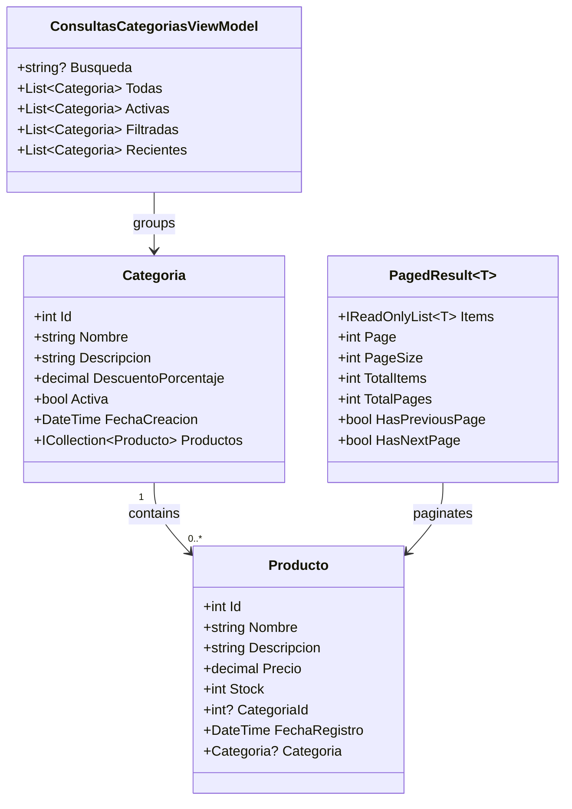
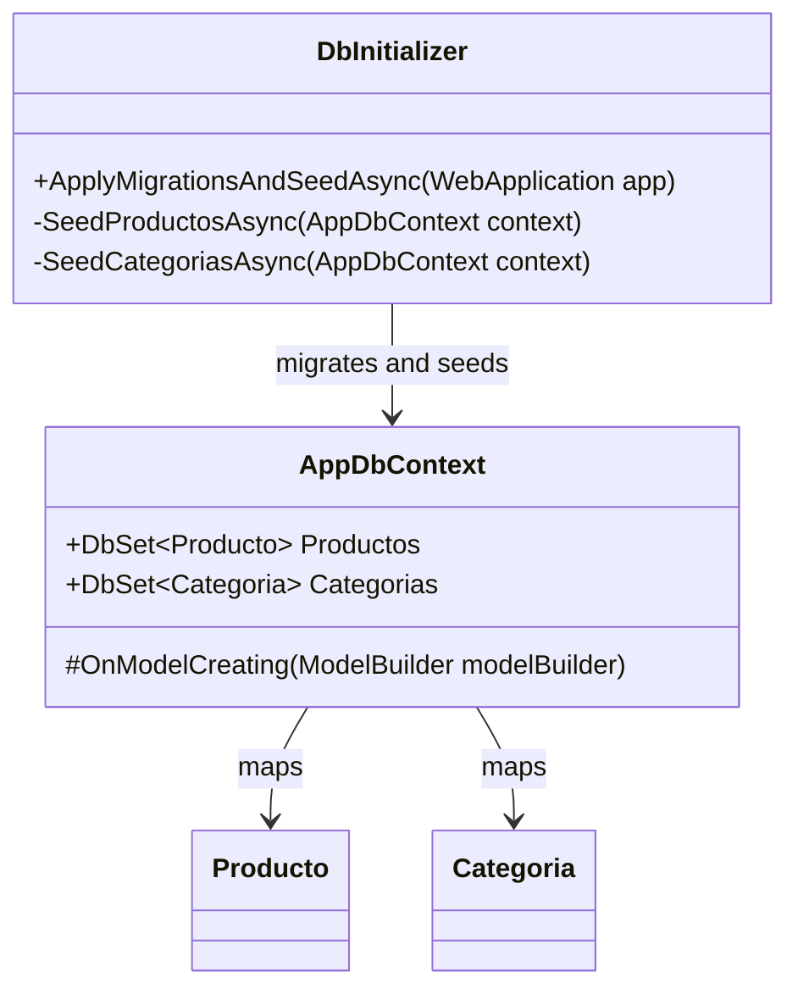
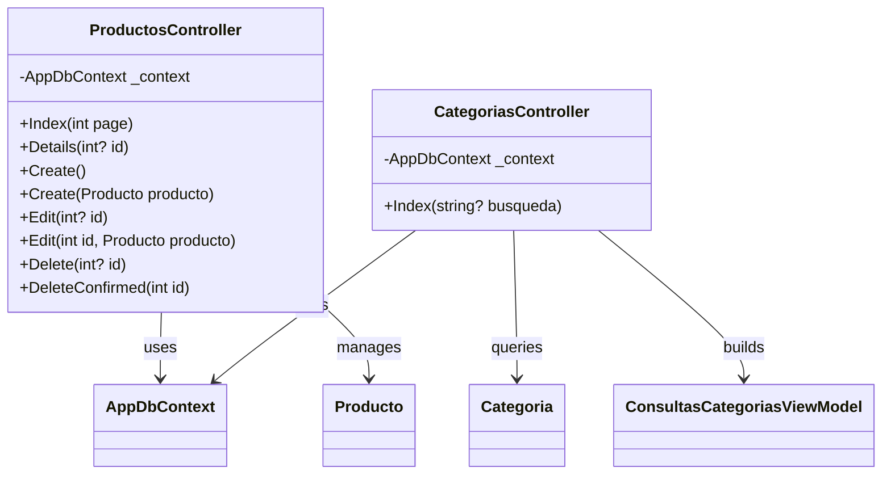
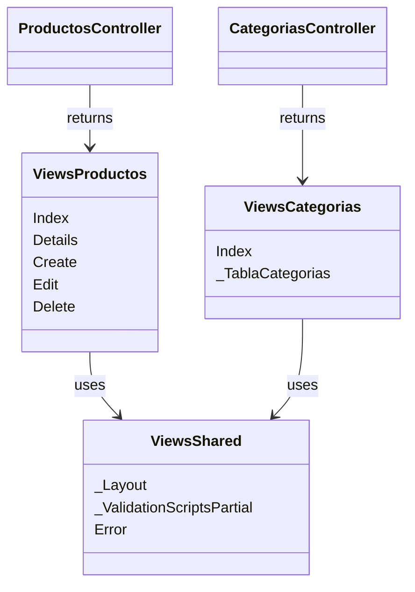

# Architecture Documentation

## Table of Contents

1. [Overview](#1-overview)
2. [Application Layers](#2-application-layers)
3. [Main Components](#3-main-components)
4. [Data Flow](#4-data-flow)
5. [Database Design](#5-database-design)
6. [Startup Process](#6-startup-process)
7. [Class Diagrams](#7-class-diagrams)
8. [Deployment Context](#8-deployment-context)

## 1. Overview

This application follows a standard ASP.NET Core MVC architecture. The project separates HTTP request handling, business-oriented data access, model definitions, Razor views, and database configuration into clear folders.

The default route opens the product module, while the category module demonstrates LINQ queries against PostgreSQL.

## 2. Application Layers

1. Presentation layer: Razor views located in `Views/` render HTML pages for products, categories, layout, validation scripts, and shared error screens.
2. Controller layer: MVC controllers in `Controllers/` receive browser requests, execute queries, validate form submissions, and select the response view.
3. Data access layer: `Data/AppDbContext.cs` exposes EF Core `DbSet` properties and model configuration.
4. Domain model layer: classes in `Models/` define the entities and view models used by controllers and views.
5. Infrastructure layer: `Program.cs`, `docker-compose.yml`, migrations, and configuration files prepare services, routing, database access, and local PostgreSQL.

## 3. Main Components

1. `Program.cs`: registers MVC services, configures `AppDbContext` with PostgreSQL, applies database migrations, seeds data, and maps the default controller route.
2. `Data/AppDbContext.cs`: defines the EF Core context with `Productos` and `Categorias`.
3. `Data/DbInitializer.cs`: applies migrations and inserts initial product and category data.
4. `Controllers/ProductosController.cs`: handles product listing, details, creation, editing, and deletion.
5. `Controllers/CategoriasController.cs`: runs LINQ queries for retrieving, filtering, ordering, and limiting category records.
6. `Models/Producto.cs`: represents products with validation for name, description, price, stock, and registration date.
7. `Models/Categoria.cs`: represents categories with validation for name and description, plus active status and creation date.
8. `Models/PagedResult.cs`: supports paginated product results.

## 4. Data Flow

1. A browser request reaches the ASP.NET Core routing middleware.
2. The route selects the matching controller and action.
3. The controller receives `AppDbContext` through dependency injection.
4. Entity Framework Core translates LINQ queries into PostgreSQL SQL commands.
5. The database returns entity data to the controller.
6. The controller builds a model or view model.
7. A Razor view renders the final HTML response.

## 5. Database Design

1. `Productos` stores product records with `Id`, `Nombre`, `Descripcion`, `Precio`, `Stock`, and `FechaRegistro`.
2. `Categorias` stores category records with `Id`, `Nombre`, `Descripcion`, `DescuentoPorcentaje`, `Activa`, and `FechaCreacion`.
3. `Productos.CategoriaId` is an optional foreign key that links products to categories.
4. Entity Framework Core migrations keep the PostgreSQL schema synchronized with the C# model definitions.
5. The category entity uses Code First configuration for required text fields, decimal precision, maximum lengths, and the product relationship.

## 6. Startup Process

1. The application builds the service container.
2. MVC services are registered with `AddControllersWithViews`.
3. `AppDbContext` is registered with the PostgreSQL connection string.
4. `DbInitializer.ApplyMigrationsAndSeedAsync(app)` runs before request handling starts.
5. Pending EF Core migrations are applied.
6. Missing seed data is inserted.
7. Static files, routing, authorization, and controller routes are enabled.

## 7. Class Diagrams

The class diagrams are divided into smaller sections to keep the MVC structure readable. Since this project is a compact CRUD application, each diagram focuses on one responsibility: domain models, data access, controllers, and views.

### 7.1 Domain Models Diagram

### 7.2 Data Access Diagram

### 7.3 MVC Controllers Diagram

### 7.4 Views Diagram

## 8. Deployment Context

1. PostgreSQL can be started locally with Docker Compose.
2. The database container binds to `127.0.0.1:5432`.
3. PostgreSQL data is stored in a named Docker volume.
4. The database password is provided through a Docker secret file.
5. The application expects a PostgreSQL connection string named `DefaultConnection`.
